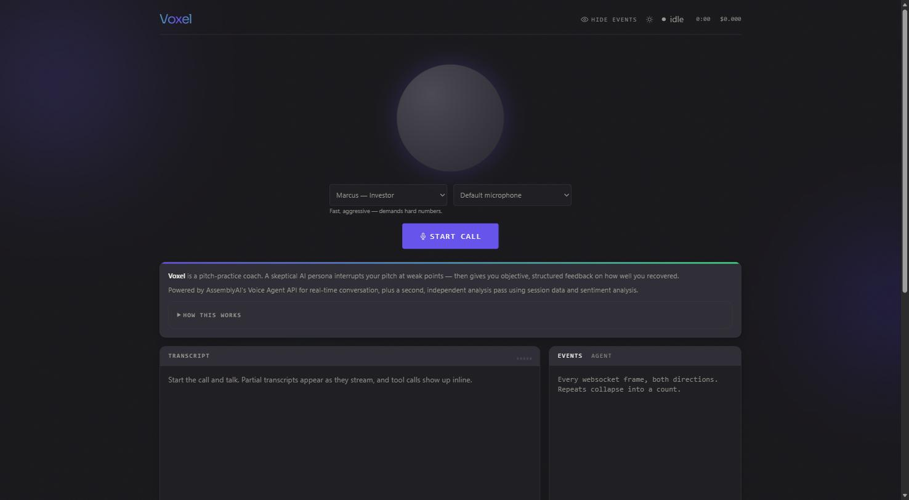
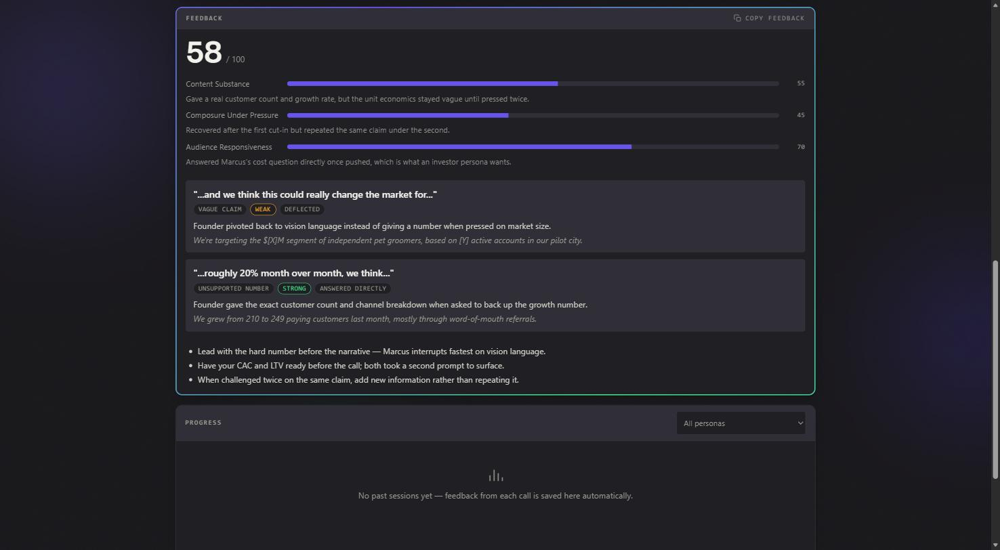

<p align="center">
  
</p>

# Voxel

Voxel is a pitch-practice coach: a voice agent that role-plays a skeptical investor or buyer, deliberately interrupts you at the weak points in your pitch, and then hands you objective, structured feedback on how well you recovered.

Built solo for the [AssemblyAI Voice Agent Hackathon](https://lablab.ai) (Sep 2026).

## What it does

Most voice-bot demos avoid interruptions — turn-taking is treated as something to get *out of the way* so the conversation feels smooth. Voxel does the opposite: it uses AssemblyAI's turn-detection as the actual product mechanic. Four counterpart personas are tuned (via `vad_threshold`, `min_silence`, `max_silence`, `interrupt_response`) to cut in on vague claims, unsupported numbers, and hesitation — the same way a real skeptical investor or buyer would.

When the call ends, the transcript doesn't just get summarized — it goes through a **second, independent judge pass**: a separate LLM call reads the full timeline (who interrupted whom, when, and what happened right after) and scores how well you recovered, turn by turn, against a fixed schema. The judge never took part in the conversation, so its score isn't the same model grading its own performance.

## Features

- **Four personas**, each its own persona and turn-detection tuning:
  - **Marcus** — an aggressive investor who demands hard numbers, not vision.
  - **Priya** — a technical co-founder candidate who probes mechanism-level depth ("what breaks at 10x?").
  - **Grace** — a non-technical enterprise buyer who interrupts out of genuine confusion at jargon.
  - **Derek** — an impatient enterprise buyer focused on concrete ROI, cost, and timeline.
- **Multi-layer post-call analysis**: the session timeline (interruption type, recovery pattern, response latency, words/sec before vs. after) is combined with sentence-level sentiment analysis from a separate transcription pass, and both are handed to the judge as context.
- **Safety nets around the judge model**: a regex-based check strips any number in `better_response_example` that never actually appeared in the transcript (the cheap model this project uses will otherwise invent a plausible-looking $45k CAC out of nowhere), with automatic retry on invalid JSON/schema and backoff retry on `429` rate limits.
- **Progress tracking**: past sessions' scores are saved locally and charted over time, per persona.
- **Self-play test infrastructure**: `tests/self_play.py` runs the four real persona prompts against seven synthetic founder behavior profiles entirely through the LLM Gateway (no audio, no Voice Agent API), to catch persona-consistency regressions cheaply before a live call.

## How AssemblyAI is used

- **[Voice Agent API](https://www.assemblyai.com/docs/voice-agents/voice-agent-api)** — the actual call. Each persona is a published agent (`agents/*.jsonc`) with a hand-tuned `turn_detection` block; the browser connects to it directly over a websocket using a short-lived token minted by `server.py`.
- **[LLM Gateway](https://www.assemblyai.com/docs/voice-agents/voice-agent-api/connect-your-own-llm)** — both the persona's own conversational LLM and the post-call judge pass run through the Gateway (`qwen3.5-4b-32k-fast`), so the whole product needs one API key and one bill, not a separate LLM provider.
- **Session history / timeline** — after the call, `GET /sessions/{id}` is used to pull the `timeline` artifact (paired `user_transcript` / `agent_text` turns with timestamps), which is what the judge actually reads.
- **Sentiment analysis** (`sentiment_analysis: true` on the classic pre-recorded transcription endpoint, `POST /v2/transcript`) — run against the call recording to get sentence-level tone, passed to the judge as extra context alongside the timeline.

## Live demo

**[voxel-hvhj.onrender.com](https://voxel-hvhj.onrender.com/)**

Hosted on Render's free tier — the first request after a while may take ~30-60s to wake up.

## Screenshots

| Hero | Feedback |
| --- | --- |
|  |  |

## Local setup

Python 3.9+, standard library only — nothing to `pip install` for the app itself.

```sh
git clone https://github.com/TunaKomurcu/Voxel
cd Voxel
cp .env.example .env
```

Add your key to `.env` (from [assemblyai.com/dashboard/api-keys](https://www.assemblyai.com/dashboard/api-keys)):

```sh
# .env
ASSEMBLYAI_API_KEY=your_key_here
```

Start the server — on first run this publishes all four personas to your AssemblyAI account and saves their agent IDs back into `.env`; later runs just update them in place:

```sh
python deployment/browser/server.py
```

Open http://localhost:3000, pick a persona, and start the call.

## Running tests

```sh
pip install -r requirements-dev.txt   # pytest only, dev-only
pytest tests/ -q
```

64 tests, covering timeline parsing, the judge's output schema, hallucination/rate-limit safety nets, and a handful of recorded edge-case sessions (very short calls, zero interruptions, mid-sentence hesitation).

`tests/self_play.py` is separate from the pytest suite — it's a standalone script that generates synthetic founder-vs-persona conversations through the LLM Gateway to check persona consistency without needing a live microphone. See its docstring for usage (`python tests/self_play.py --run`).

## Project structure

```
lib.py                    Shared plumbing: .env, agent files, AssemblyAI + Twilio API calls
judge.py                  Session/timeline retrieval, interruption detection, the judge pass
publish.py                Publish a single agents/*.jsonc file (legacy single-agent flow)
import_agent.py           Pull an existing agent down into a agents/*.jsonc file
agents/                   One JSON(C) file per agent — the four personas plus starter examples
deployment/browser/       server.py, index.html, app.js — the browser client
deployment/telephony/     Twilio phone-number integration (not used in the hosted demo)
tests/                    pytest suite, fixtures, self_play.py, judge_eval.py
```

See [PLAN.md](PLAN.md) for the day-by-day development process and [TESTING.md](TESTING.md) for how judge objectivity was verified.

## Tech stack

- **Backend**: Python, standard library only (no framework, no ORM, no pip dependencies outside of `pytest` for tests).
- **Voice + LLM**: AssemblyAI Voice Agent API and LLM Gateway.
- **Frontend**: vanilla JS/HTML/CSS, [Chart.js](https://www.chartjs.org/) for the progress graph.
- **Hosting**: Render (free tier).

## License

[MIT](LICENSE)
